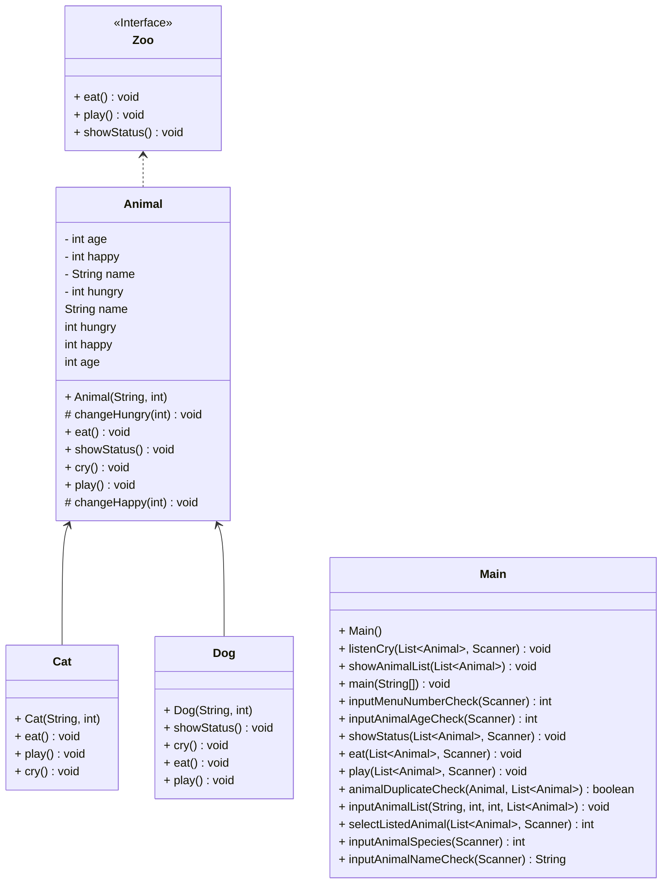

<h1>동물 관리 프로그램</h1>

- 기수 : 스프링 2기
- 이름 : 김영재
---

<h2>클래스 관계도 -> 1단계</h2>

```mermaid
classDiagram
direction BT
class Animal {
  + Animal(String, int) 
  - int age
  - int happy
  - String name
  - int hungry
  # changeHungry(int) void
  + eat() void
  + showStatus() void
  + cry() void
  + play() void
  # changeHappy(int) void
   String name
   int hungry
   int happy
   int age
}
class Cat {
  + Cat(String, int) 
  + eat() void
  + play() void
  + cry() void
}
class Dog {
  + Dog(String, int) 
  + showStatus() void
  + cry() void
  + eat() void
  + play() void
}
class Main {
  + Main() 
  + listenCry(List~Animal~, Scanner) void
  + showAnimalList(List~Animal~) void
  + main(String[]) void
  + inputMenuNumberCheck(Scanner) int
  + inputAnimalAgeCheck(Scanner) int
  + showStatus(List~Animal~, Scanner) void
  + eat(List~Animal~, Scanner) void
  + play(List~Animal~, Scanner) void
  + animalDuplicateCheck(Animal, List~Animal~) boolean
  + inputAnimalList(String, int, int, List~Animal~) void
  + selectListedAnimal(List~Animal~, Scanner) int
  + inputAnimalSpecies(Scanner) int
  + inputAnimalNameCheck(Scanner) String
}
class Zoo {
<<Interface>>
  + eat() void
  + play() void
  + showStatus() void
}

Animal  ..>  Zoo 
Cat  -->  Animal 
Dog  -->  Animal
```
---

<h2>기타</h2>
- 각 레벨 별 README는 내부에 위치
